# Defending Storage Buckets with ScoutSuite

Google Cloud Buckets are the basic containers that hold your data. Everything that you store in Cloud Storage must be contained in a bucket. You can use buckets to organize your data and control access to your data, but unlike directories and folders, you cannot nest buckets.

You can create buckets in GCP Storage using the Buckets resource. All buckets share a single global namespace. An object contained in GCP buckets has its methods for interacting with it. A bucket contains bucket AccessControls, which allows fine-grained manipulation of the access controls of an existing bucket.

Misconfigured storage can leak the company's or an organization's sensitive data, leading to a huge loss.

ScoutSuite is an open-source security tool that helps security professionals assess the security of their Amazon Web Services (AWS), Microsoft Azure environments, and Google Cloud Platform (GCP). The tool is designed to automate auditing cloud infrastructure for security risks and vulnerabilities. It analyzes various security configurations and misconfigurations that could leave the environment vulnerable to attack.

# Solutions

**Step 1:** Open the web application.

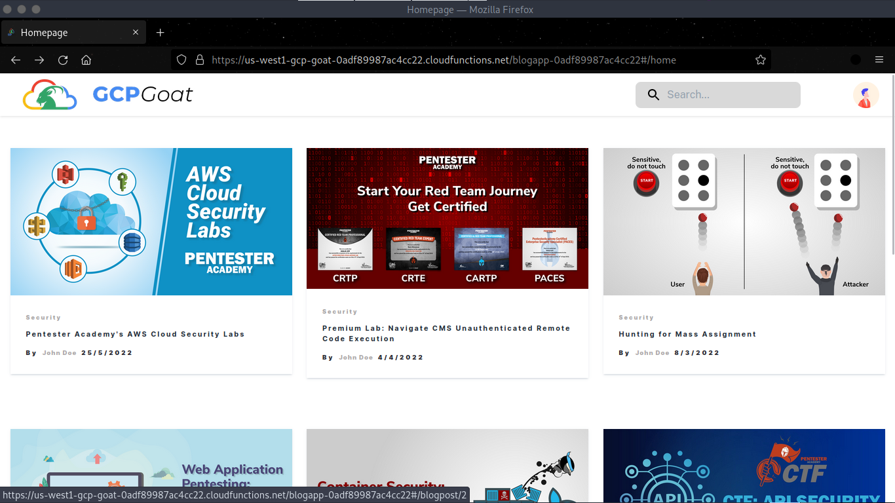

**Step 2:** Now, right-click on the blog and click on "Open image in New Tab".


**Step 3:**   Here you find that the image is being fetched from a google storage bucket.


You can find the name of the bucket as highlighted in the above image, after the storage.googleapis.com. Take note of this name.

**Step 4:** Replace prod with dev and see if you get the same image.


As we can see the dev URL is publically available and whose storage name is similar to prod.

**Step 5:** Use the below URL to find out all the permissions you have on this bucket.

```
https://www.googleapis.com/storage/v1/b/BUCKET_NAME/iam/testPermissions?permissions=storage.buckets.delete&permissions=storage.buckets.get&permissions=storage.buckets.getIamPolicy&permissions=storage.buckets.setIamPolicy&permissions=storage.buckets.update&permissions=storage.objects.create&permissions=storage.objects.delete&permissions=storage.objects.get&permissions=storage.objects.list&permissions=storage.objects.update
```

**Note:** replace BUCKET_NAME with your current bucket name.

The Google Storage TestIamPermissionsAPI allows us to supply a bucket name and list of Google Storage permissions, and it will respond with the permissions we have on that bucket.

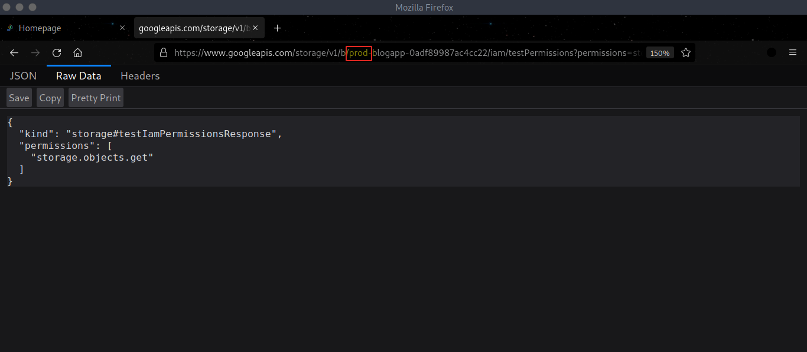

This bucket only has read access which is "storage.buckets.get". But it is the prod bucket now see for the dev bucket also.

**Step 6:** List out all the permissions we have on the dev bucket.

```
https://www.googleapis.com/storage/v1/b/BUCKET_NAME/iam/testPermissions?permissions=storage.buckets.delete&permissions=storage.buckets.get&permissions=storage.buckets.getIamPolicy&permissions=storage.buckets.setIamPolicy&permissions=storage.buckets.update&permissions=storage.objects.create&permissions=storage.objects.delete&permissions=storage.objects.get&permissions=storage.objects.list&permissions=storage.objects.update
```

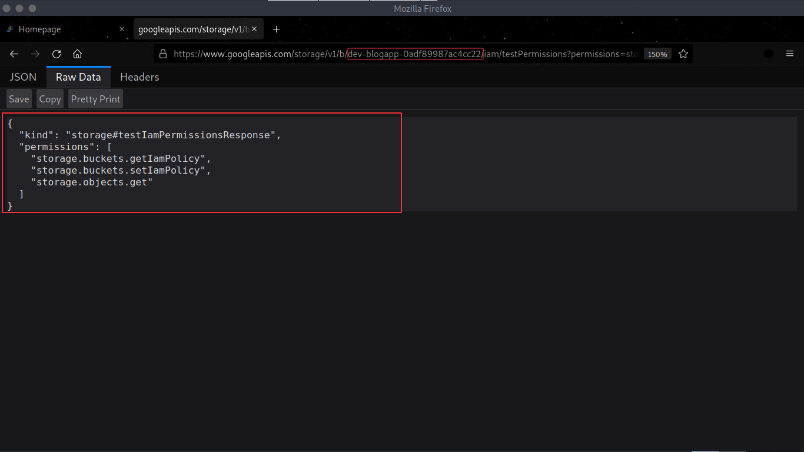

Here we have two excessive permission along with the get permissions.

* storage.buckets.setIamPolicy - This grants permission to set IAM policies in the bucket.
* storage.buckets.getIamPolicy - This grants permission to read IAM policies in the bucket.

We will use Scoutsuite to detect misconfigurations in our storage account. To use the ScoutSuite, we need to clone the ScoutSuite repository.

**Step 7:** Set up the scoutsuite on your local machine.


ScoutSuite is an open-source tool that supports multiple cloud providers including GCP. It also makes all the results save in a local file which means no compromise of your data which is a plus too for free.

For setup, we can refer to wiki setup and install it by pip or we can also choose to use it by git clone.


**Step 8:** Setup virtual environment for scoutsuite with
```
virtualenv -p python3 venv
```


**Step 9:** Activate the newly created virtual environment with

```
source venv/bin/activate
```

And install scoutsuite as demonstrated in a below image
```
pip install scoutsuite
```


Wait for it to complete it will take some moments.


**Step 10:** Run the following command to launch the scout for GCP.

```
scout gcp --user-account --project-id GCP-PROJECT-ID
```

**Note:** Replace your project id with GCP-PROJECT-ID


It takes time, depending on the number of resources that you have.


After fetching information from all resources, it opens the following report page on your default browser.

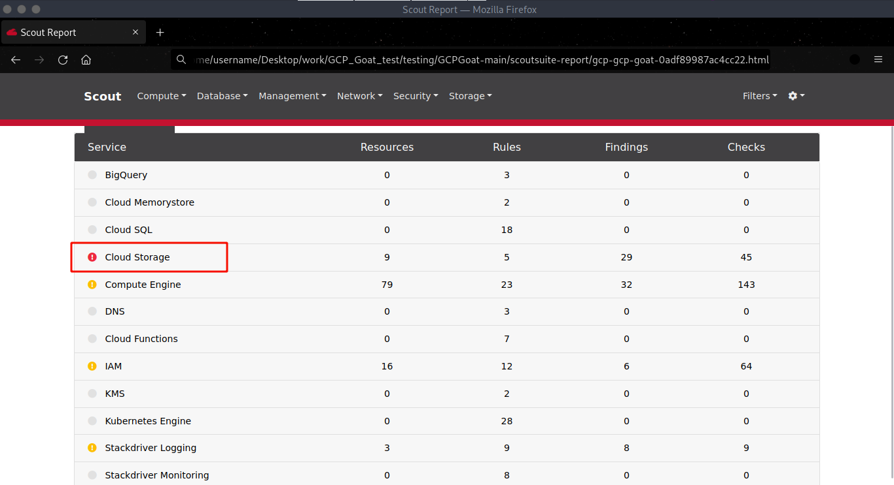

The red colored warning symbol indicates Danger, the Yellow colored warning symbol indicates Warning and the Green colored warning symbol indicates Good.

**Step 11:** Click on the Cloud Storage Section and you will get the below image.

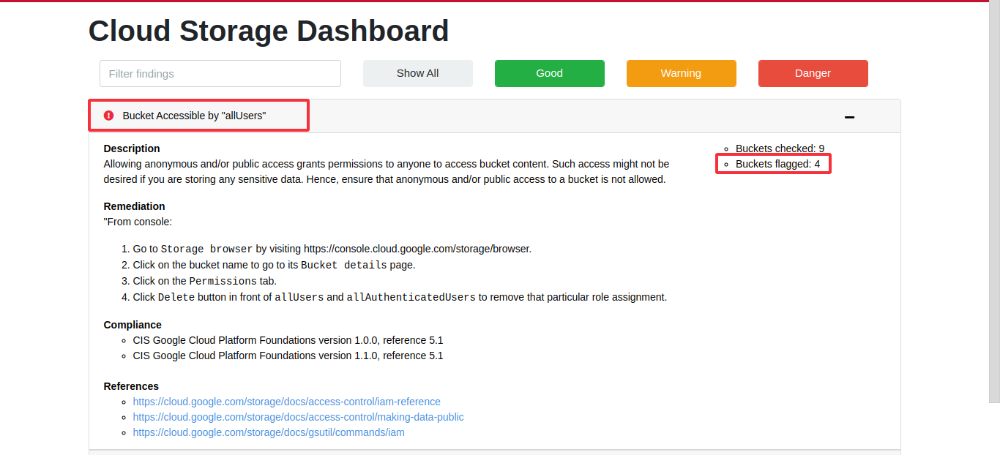

Here it is visible that buckets (flagged are 4) are accessible by allUsers which can be problematic if cases are not handled correctly.

**Step 12:** Click on the *Bucket Accessible by "allUsers"*.

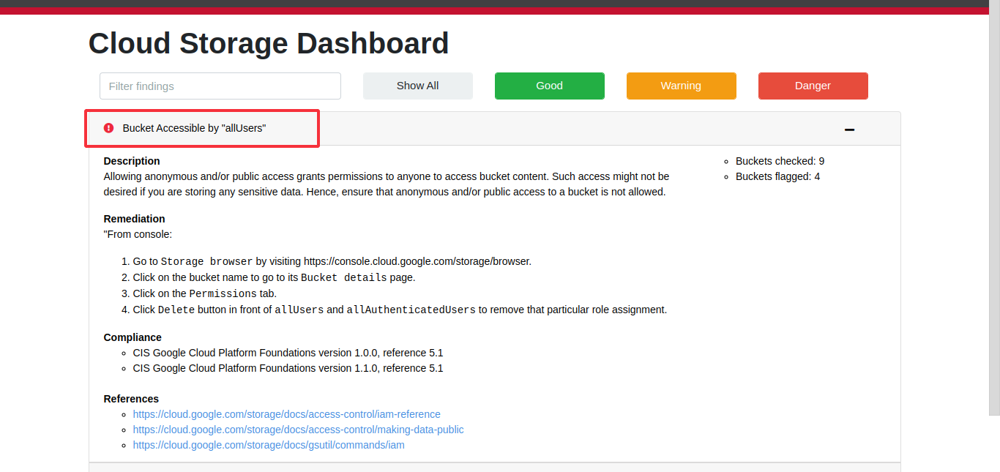

And will get all the information about which four resources were misconfigured and because of that in a danger section, here you can see allUsers in a red shade others are in normal black.

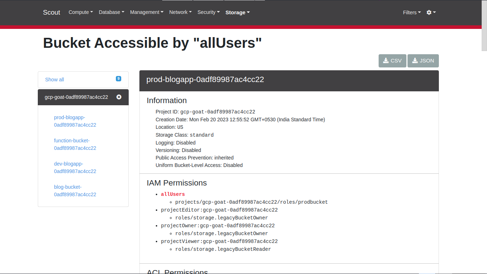

**Step 13:** To Fix the problem, open the portal and select GCP-Goat project-id.

Now, will log-in to your google account where gcp goat is deployed and choose that project-id.


**Step 14:** Select the Cloud Storage Buckets.

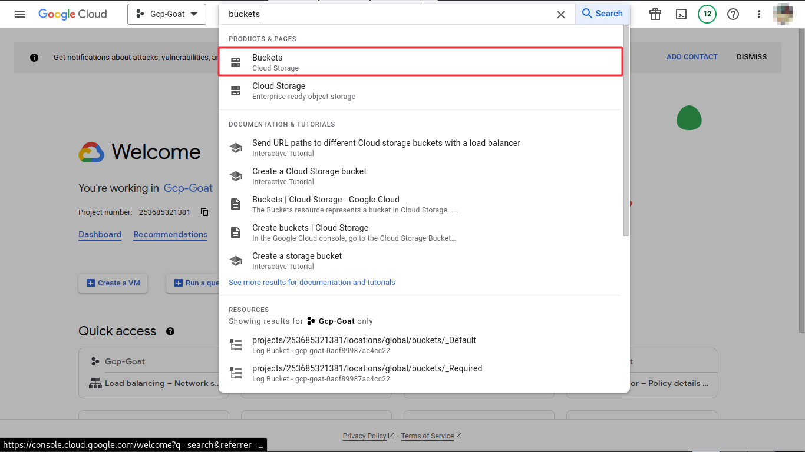

And there we see four buckets are public to the internet which are not at all needed.


**Step 15:** Change the permission for the buckets.

To revoke public access for a bucket we have to open it and click on permissions as shown in the image below


In the permission section, there is prevent public access which prevents allUsers on the internet to have access to all the data on the bucket which also leads to a sensitive data leak.

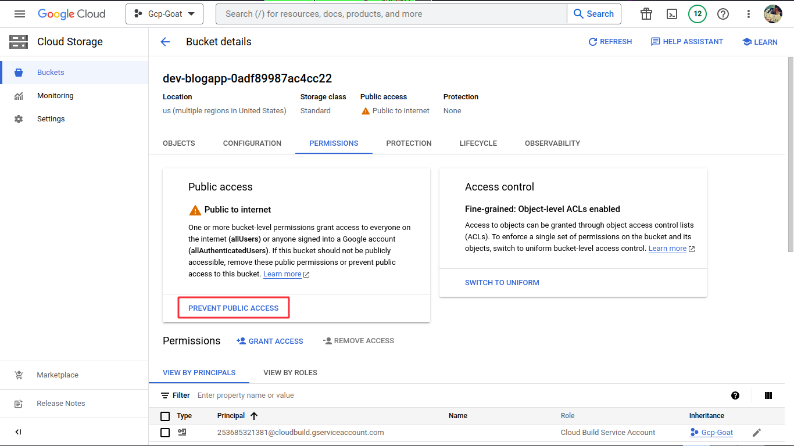

Click on confirm to revoke the internet access for the bucket.

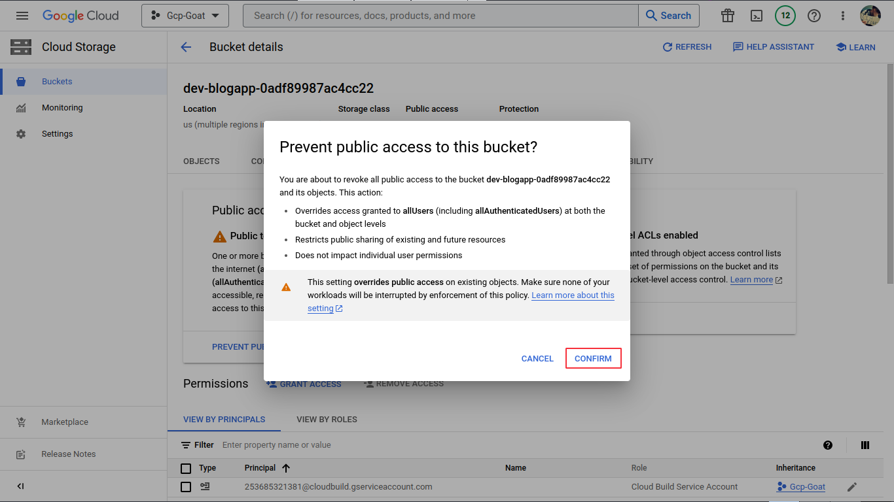

**Step 16:** Checking for production bucket.

For the prod bucket, it should be important to make it available for all or restricted one. but to access the data we have to make it public so have to see if its iam role is okay otherwise it can be misused.

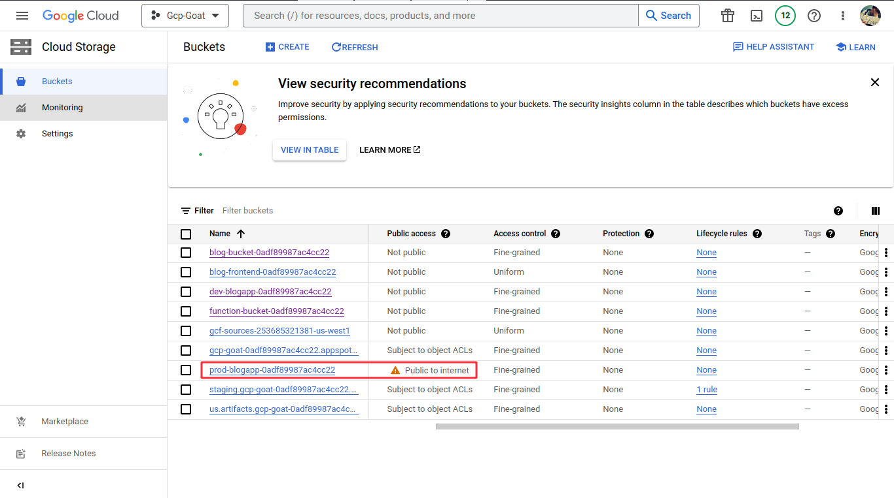

For that, we go to the permission section

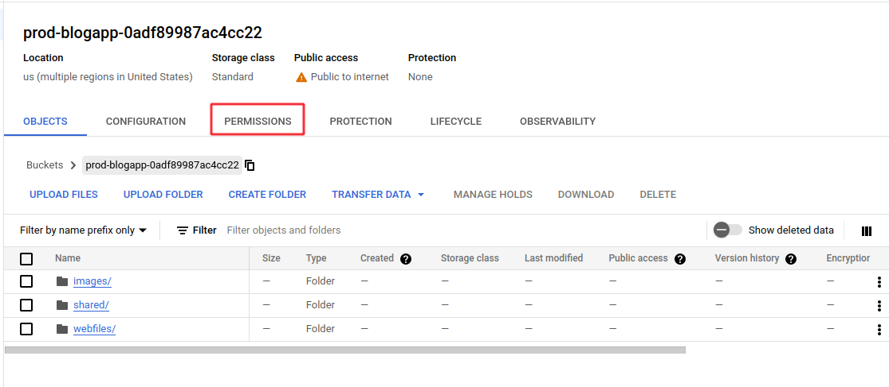

And find the role associated with allUsers principal.

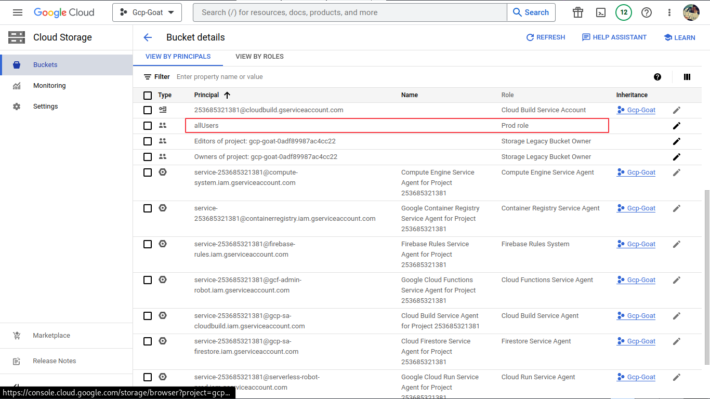

**Step 17:** Double-check the prod role.

To check the role you should have to go for IAM role as shown below


There it should visible on the top of the list, select it.

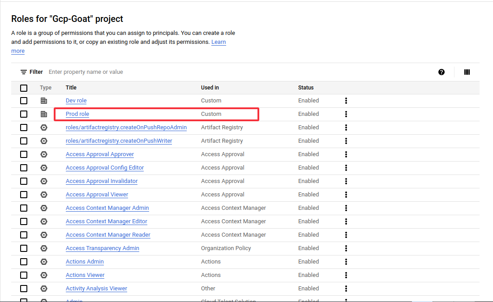

And there it's only one policy attached which would be essential to display images and all for our application.

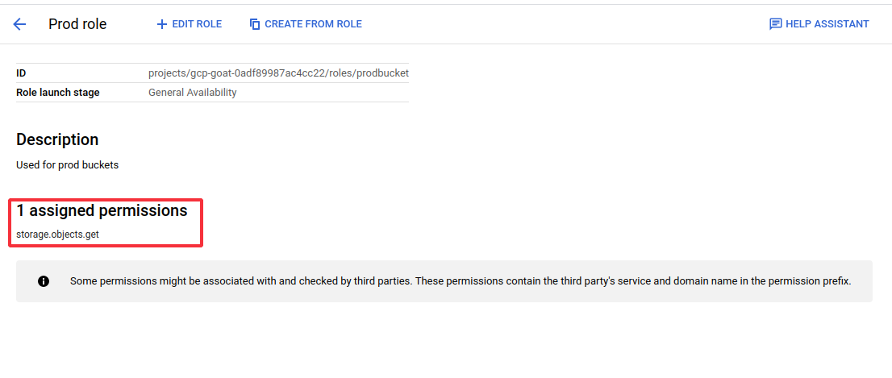


**Step 18:** Go back to the listed out permission for dev-bucket and click on the Refresh button (done on step 6).

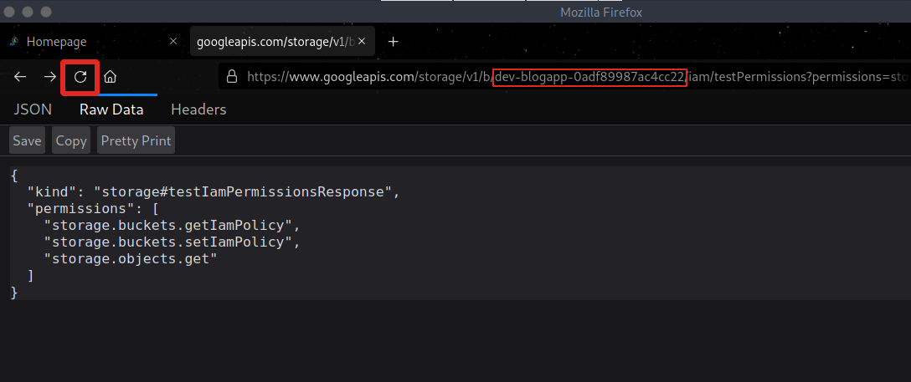

You will notice no overly excessive permission are available for that bucket through the internet.


We properly re-configured our cloud buckets.

## In Addition

In addition we can also take care of dev role which was having high level access.

**Step 19:** Open IAM roles for edit dev role.

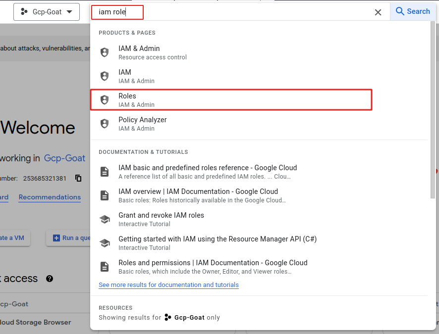

**Step 20:** Select the Dev role to update it's role.

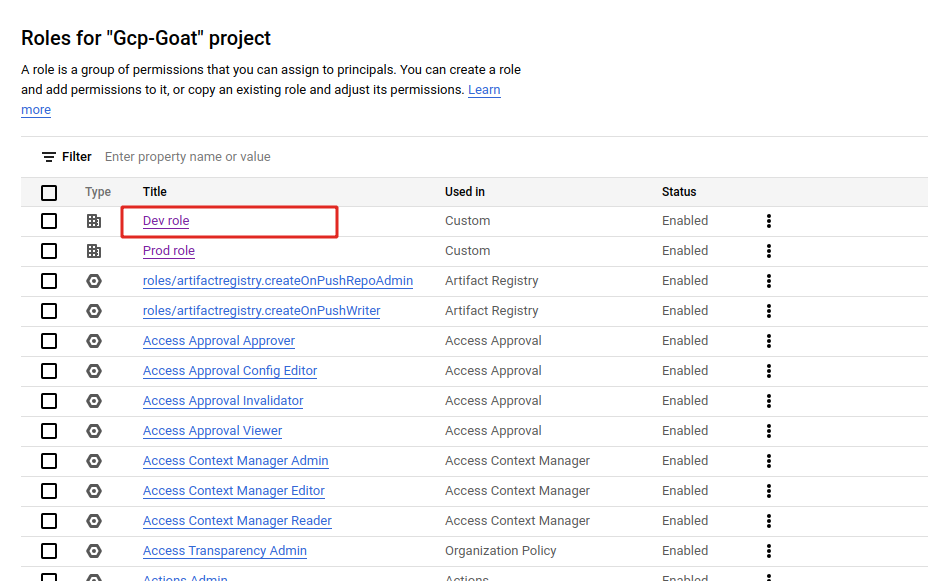

In the list of permissions given to role it is setting up iam policy but this role provided bucket was also available to internet which could lead to a problem to minimize the damage we will restrict these permission.

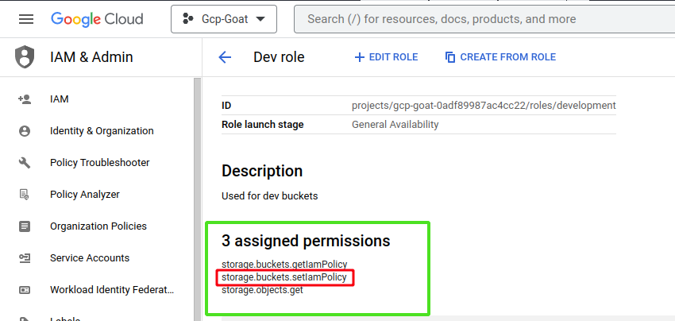

**Step 21:** Click on Edit Role.

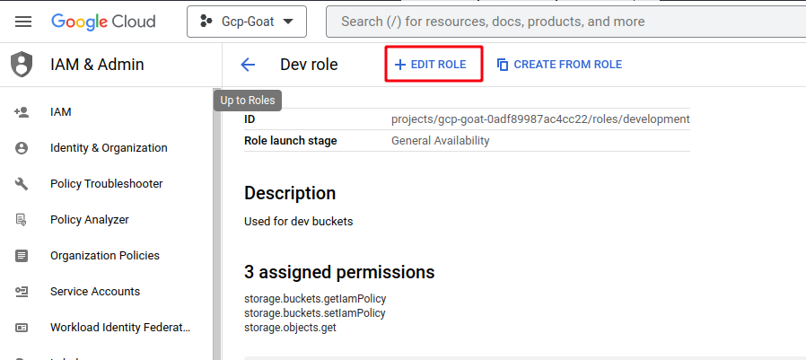

Uncheck first two marked permission as shown in the below image.

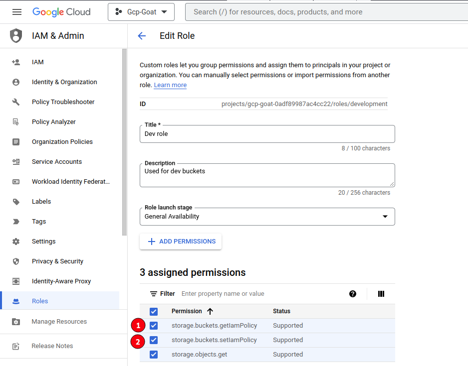

So it will have the least permission to be dangerous for the production bucket or infrastructure.

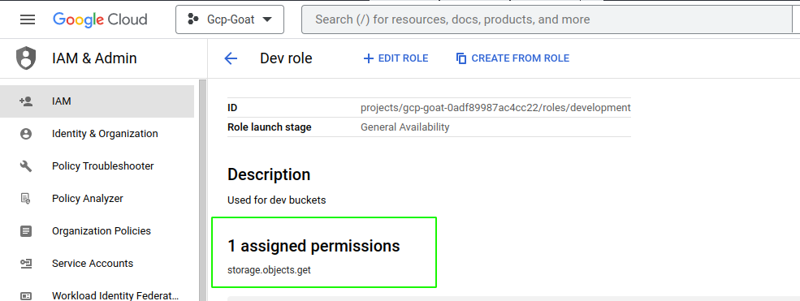

We have learnt how to use ScoutSuite and manage importance of iam role.

# References

ScoutSuite: https://github.com/nccgroup/ScoutSuite
